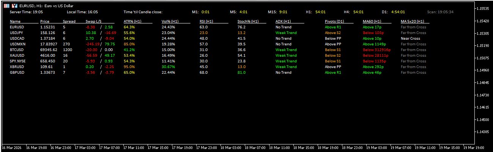

# FxTT MT5 Forex Scanner – Free Multi-Pair Indicator


> A free, open-source MT5 multi-pair scanner that shows Price, Spread, Swap, ATR, Volume, RSI, Stochastic, ADX, Pivot Points, MA direction, and MA Cross status for your entire watchlist — on a single auto-refreshing on-chart dashboard. With built-in alerts and push notifications.



---

## 📌 Overview

The **FxTT MT5 Forex Scanner** is a free multi-pair indicator for MetaTrader 5 that eliminates the need to open individual charts to check your indicators. It scans every symbol in your Market Watch — or a custom pair list — and displays **11 live data columns per pair** in a single clean, auto-refreshing dashboard directly on your chart.

Built by me [Carlos Oliveira](https://forextradingtools.eu) and used as part of my own live trading workflow, the scanner is designed for traders who want instant, market-wide awareness: which pairs are approaching overbought or oversold extremes, which are trending strongly, and which have just crossed moving averages — without opening a single extra chart.

**Product page & documentation:** [forextradingtools.eu/products/indicators/mt5-forex-scanner-free](https://forextradingtools.eu/products/indicators/mt5-forex-scanner-free/)

---

## ✨ Features

- **Scans all Market Watch pairs** — or switch to a custom comma-separated pair list
- **11 data columns per pair** — Price, Spread, Swap, ATR %, Volume %, RSI, Stochastic, ADX, Pivots, MA, and MA Cross
- **Color-coded signal cells** — RSI and Stochastic cells highlight automatically in overbought/oversold zones
- **Independent timeframes per indicator** — configure ATR, Volume, RSI, Stochastic, ADX, MA, and MA Cross on separate timeframes
- **Alerts with push notifications** — fire on RSI extremes, Stochastic extremes, and MA crossovers, delivered to your MT5 mobile app
- **Per-symbol alert cooldown** — configurable cooldown in hours prevents repeated alerts for the same condition
- **Near-cross detection** — flags when fast and slow MAs are within ATR proximity of crossing
- **Scanner-only chart mode** — hides all chart elements with a clean black background
- **Multi-column layout** — set max rows per column; new columns are created automatically when exceeded
- **Font size scaling** — the entire panel layout (widths, heights, spacing) scales proportionally with font size
- **Ghost-row cleanup** — rows for symbols removed from Market Watch are automatically deleted
- **Chart restoration on removal** — original chart colors and appearance are fully restored when the indicator is removed
- **Auto-refresh timer** — configurable refresh interval (minimum 5 seconds) to balance freshness and server load

---

## 📊 Dashboard Columns

| Column | Description |
|--------|-------------|
| **Price** | Live bid price for each symbol |
| **Spread** | Current spread in points — instant trading cost comparison |
| **Swap** | Long and short swap values with color-coded direction indicator |
| **ATR %** | Current ATR as % of its rolling average — see if volatility is elevated or compressed |
| **Volume %** | Current volume as % of its rolling average — highlights unusual spikes or quiet sessions |
| **RSI** | RSI value, color-coded green (oversold) and red (overbought) based on your thresholds |
| **Stochastic** | Stochastic %K value, color-coded by overbought/oversold thresholds |
| **ADX** | ADX value with +DI/−DI direction — trend strength and direction in one cell |
| **Pivots** | Today's pivot level; hover to see all S/R levels and pip distance from current price |
| **MA** | Whether price is above or below the MA and the pip distance from price to the MA line |
| **MA Cross** | Current fast/slow MA crossover state: bullish, bearish, or near-cross |

Every column can be shown or hidden independently to match your trading strategy.

---

## 🔔 Alert System

The built-in alert engine monitors all scanned symbols continuously and fires when any of these conditions are detected:

| Alert Type | Trigger |
|------------|---------|
| **RSI Overbought** | RSI crosses above your configured upper level |
| **RSI Oversold** | RSI crosses below your configured lower level |
| **Stochastic Overbought** | Stochastic crosses above your configured upper level |
| **Stochastic Oversold** | Stochastic crosses below your configured lower level |
| **MA Cross** | Fast MA crosses the slow MA on any scanned symbol |

Each alert type is independently toggleable. Alerts include the symbol name, the triggered condition, and the current indicator value. Enable **Push Notifications** to receive alerts directly in the MetaTrader 5 mobile app.

A configurable **per-symbol cooldown** (in hours) prevents alert spam when a condition persists.

---

## 🖥️ Platform Requirements

- **Platform:** MetaTrader 5 (MT5)
- **File type:** `.ex5` (compiled) / `.mq5` (source)
- **Version:** 1.30 (March 2026)
- **Instruments:** Forex, gold, indices, crypto, and all MT5-supported symbols

> ⚠️ This indicator is **MT5 only** and is not compatible with MT4. For the MT4 version, see [FxTT Multi-purpose Forex Scanner for MT4](https://forextradingtools.eu/products/indicators/forex-scanner-free/).

---

## 🚀 Installation

1. Download `FXTT_Fx_Scanner.ex5` from the [Releases](https://github.com/ForexTradingTools/fxtt-mt5-forex-scanner/releases) page
   *(or compile `FXTT_Fx_Scanner.mq5` yourself in the MetaEditor)*
2. Open MT5 → **File → Open Data Folder**
3. Navigate to `MQL5/Indicators/`
4. Copy `FXTT_Fx_Scanner.ex5` into that folder
5. Restart MT5 (or right-click the Navigator panel → **Refresh**)
6. Find **FXTT_Fx_Scanner** under **Navigator → Indicators**
7. Drag it onto any chart — the scanner panel will appear immediately
8. Configure your columns, timeframes, and alert settings in the Inputs tab

> **Tip:** Attach the scanner to a dedicated background chart on any symbol. It reads all Market Watch pairs regardless of the chart's own symbol or timeframe, so you can keep it running independently while trading from other charts.

---

## ⚙️ Settings Reference

### General

| Parameter | Default | Description |
|-----------|---------|-------------|
| `Show Symbols From` | Market Watch | Source of symbols: Market Watch or Custom List |
| `Custom List` | — | Comma-separated symbols, e.g. `EURUSD,GBPUSD,USDJPY` |
| `Timer Interval (secs)` | 60 | Data refresh rate — minimum 5 seconds |
| `Font Size` | 8 | Scales the entire panel layout proportionally |
| `Font Name` | Calibri | Panel font family |
| `Column Height` | 50 | Max rows per column before starting a new column |
| `Hide Chart Elements` | true | Scanner-only mode — black background, chart elements hidden |
| `Text Color` | White | White for dark themes, black for light themes |

### Columns — Show/Hide

| Parameter | Default |
|-----------|---------|
| `Show Price` | true |
| `Show Spread` | true |
| `Show Swap` | true |
| `Show ATR` | true |
| `Show Volume` | true |
| `Show RSI` | true |
| `Show Stochastic` | true |
| `Show ADX` | true |
| `Show Pivots` | true |
| `Show MA` | true |
| `Show MA Cross` | true |

### ATR
| Parameter | Default | Description |
|-----------|---------|-------------|
| `ATR Timeframe` | H1 | Timeframe for ATR % calculation |
| `ATR Period` | 20 | Lookback period for ATR |

### Volume
| Parameter | Default | Description |
|-----------|---------|-------------|
| `Volume Timeframe` | H1 | Timeframe for average volume calculation |
| `Volume Period` | 60 | Number of bars for average volume |

### RSI
| Parameter | Default | Description |
|-----------|---------|-------------|
| `RSI Timeframe` | H1 | Timeframe for RSI calculation |
| `RSI Period` | 14 | RSI lookback period |
| `RSI Upper Level` | 75 | Overbought threshold (shown in red) |
| `RSI Lower Level` | 25 | Oversold threshold (shown in green) |

### Stochastic
| Parameter | Default | Description |
|-----------|---------|-------------|
| `Stoch Timeframe` | H1 | Timeframe for Stochastic calculation |
| `%K Period` | 5 | %K period |
| `%D Period` | 3 | %D period |
| `Slowing` | 3 | Slowing parameter |
| `MA Method` | SMA | Moving average method |
| `Stoch Upper Level` | 80 | Overbought threshold |
| `Stoch Lower Level` | 20 | Oversold threshold |

### ADX
| Parameter | Default | Description |
|-----------|---------|-------------|
| `ADX Timeframe` | H1 | Timeframe for ADX calculation |
| `ADX Period` | 20 | ADX lookback period |

### Pivots
| Parameter | Default | Description |
|-----------|---------|-------------|
| `Pivot Timeframe` | D1 | Timeframe used to calculate pivot levels |

### Moving Average (MA Direction)
| Parameter | Default | Description |
|-----------|---------|-------------|
| `MA Timeframe` | H1 | Timeframe for MA direction and pip distance |
| `MA Period` | 60 | MA lookback period |
| `MA Method` | SMA | MA calculation method |
| `MA Applied Price` | Close | Price used in MA calculation |

### MA Cross
| Parameter | Default | Description |
|-----------|---------|-------------|
| `Fast MA Timeframe / Period / Method` | H1 / 5 / SMA | Fast MA configuration |
| `Slow MA Timeframe / Period / Method` | H1 / 20 / SMA | Slow MA configuration |
| `MA Cross ATR Period` | 20 | ATR period used for near-cross proximity detection |

### Alerts
| Parameter | Default | Description |
|-----------|---------|-------------|
| `Alert on RSI` | false | Fire alert when RSI crosses overbought/oversold thresholds |
| `Alert on Stochastic` | false | Fire alert when Stochastic crosses thresholds |
| `Alert on MA Cross` | false | Fire alert on fast/slow MA crossover |
| `Push Notifications` | false | Send alerts to MT5 mobile app |
| `Alert Cooldown (hours)` | 4 | Per-symbol cooldown to prevent repeated alerts |

---

## 💡 How to Use It

1. **Find momentum confluences** — Look for pairs where RSI and Stochastic agree (both overbought or both oversold) at the same time
2. **Confirm trend strength before entering** — Use the ADX column to skip low-ADX, choppy pairs and focus on trending ones
3. **Anticipate crossovers early** — The near-cross detection in the MA Cross column flags approaching crossovers before they complete
4. **Check pivot proximity** — Trade setups where price is approaching a key pivot support or resistance level
5. **Monitor volatility regime** — ATR % above 100% means the current bar is more volatile than average — useful for sizing or timing
6. **Filter by spread** — Avoid entering on pairs with unusually wide spreads, especially during low-liquidity sessions
7. **Set alerts and step away** — Configure RSI, Stochastic, or MA Cross alerts with push notifications and let the scanner monitor your full watchlist for you

---

## 🖥️ Compatibility

- **Platform:** MetaTrader 5 (MT5)
- **File type:** `.ex5` compiled file / `.mq5` source file
- **Version:** 1.30
- **Instruments:** Forex, gold, indices, crypto, and other MT5-supported symbols
- **Install folder:** `MQL5/Indicators/`

---

## 🗂️ Repository Structure

```
fxtt-mt5-forex-scanner/
├── src/
│   └── FXTT_Fx_Scanner.mq5        # Full MQL5 source code
├── releases/
│   └── FXTT_Fx_Scanner.ex5        # Compiled MT5 binary (ready to install)
├── screenshots/
│   ├── scanner-dashboard.png       # Scanner running on MT5
│   └── scanner-settings.png        # Settings panel
└── README.md
```

---

## 📝 Changelog

### v1.30 — March 2026
- Added **Swap column** with long/short values and color-coded direction
- Added **MA direction column** — price vs MA with pip distance
- Added **MA Cross column** — fast/slow MA crossover state with near-cross detection
- Added **push notification alerts** for RSI, Stochastic, and MA Cross events
- Added **per-symbol alert cooldown** to prevent alert spam
- Added **multi-column layout** — panel automatically starts new columns when row limit is exceeded
- Added **ghost-row cleanup** — stale rows auto-deleted when symbols are removed from Market Watch
- Added **chart restoration on removal** — full chart appearance recovery on indicator deinit
- Font size scaling now applies to all panel dimensions proportionally

### v1.00
- Initial release
- Columns: Price, Spread, ATR %, Volume %, RSI, Stochastic, ADX, Pivot Points

---

## 🤝 Contributing

Contributions are welcome. If you find a bug or want to propose an improvement:

1. Fork this repository
2. Create a feature branch (`git checkout -b feature/my-improvement`)
3. Commit your changes (`git commit -m 'Add my improvement'`)
4. Push to the branch (`git push origin feature/my-improvement`)
5. Open a Pull Request

For significant changes, please open an issue first to discuss what you'd like to change.

---

## ❓ FAQ

**Is this indicator free?**  
Yes, completely free to download and use.

**Does it work on any chart timeframe?**  
Yes. Attach it to any chart on any timeframe — the scanner reads data from its own independently configured timeframes.

**Can I use it alongside Expert Advisors?**  
Yes. The scanner is a visual-only indicator and does not interfere with EAs on the same or other charts.

**Why does the chart turn black?**  
This is the Hide Chart Elements feature. Disable it in settings to keep your existing chart appearance. The original chart state is always restored when the indicator is removed.

**Can I run it on a VPS?**  
Yes. The indicator runs normally on a VPS and continues scanning and alerting as long as MT5 is running.

**Is there an MT4 version?**  
Yes — see the [FxTT Multi-purpose Forex Scanner for MT4](https://forextradingtools.eu/products/indicators/forex-scanner-free/).

---

## Related FxTT repositories

The public FxTT indicator family is split across these repositories:

- [FxTT MT4 Forex Scanner](https://github.com/ForexTradingTools/fxtt-mt4-forex-scanner)
- [FxTT MTF Triple MA MT5](https://github.com/ForexTradingTools/fxtt-mt5-mtf-triple-moving-averages)
- [FxTT Pivot Points MT5](https://github.com/ForexTradingTools/fxtt-mt5-pivot-points)
- [FxTT Session High/Low MT5](https://github.com/ForexTradingTools/fxtt-mt5-session-high-low)
- [FxTT News Calendar MT5](https://github.com/ForexTradingTools/fxtt-mt5-news-calendar)
- [FxTT ZigZag Zones MT5](https://github.com/ForexTradingTools/fxtt-mt5-zig-zag-zones)
- [FxTT MTF Bollinger Bands MT4](https://github.com/ForexTradingTools/fxtt-mt4-mtf-bollinger-bands)
- [FxTT MTF Bollinger Bands MT5](https://github.com/ForexTradingTools/fxtt-mt5-mtf-bollinger-bands)
- [FxTT MTF Triple MA MT4](https://github.com/ForexTradingTools/fxtt-mt4-mtf-triple-moving-averages)
- [FxTT Strategy Checklist MT4](https://github.com/ForexTradingTools/fxtt-mt4-strategy-checklist)
- [FxTT Strategy Checklist MT5](https://github.com/ForexTradingTools/fxtt-mt5-strategy-checklist)

## 📄 License

This project is licensed under the **MIT License** — you are free to use, modify, and distribute this code, provided the original copyright notice is retained.

See [LICENSE](./LICENSE) for details.

---

## 🔗 More Free Tools

All free indicators and EAs from Forex Trading Tools:

- 🔗 [FxTT Multi-purpose Forex Scanner – Free MT4 Indicator](https://forextradingtools.eu/products/indicators/forex-scanner-free/)
- 🔗 [Strategy Checklist – Free MT4 Indicator](https://forextradingtools.eu/products/indicators/strategy-checklist-free-indicator/)
- 🔗 [MTF Triple Moving Averages – Free MT4 Indicator](https://forextradingtools.eu/products/indicators/mtf-triple-moving-averages-free-indicator/)
- 🔗 [MTF Bollinger Bands – Free MT4 Indicator](https://forextradingtools.eu/products/indicators/mtf-bollinger-bands-indicator/)
- 🔗 [MTF Bollinger Bands MT5 – Free MT5 Indicator](https://forextradingtools.eu/products/indicators/mtf-bollinger-bands-mt5-indicator/)
- 🔗 [Pivot Points – Free MT5 Indicator](https://forextradingtools.eu/products/indicators/pivot-points-mt5-free/)

---

*Made with ❤️ by [Carlos Oliveira](https://forextradingtools.eu) | Forex Trading Tools*
